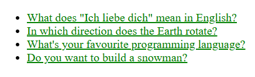
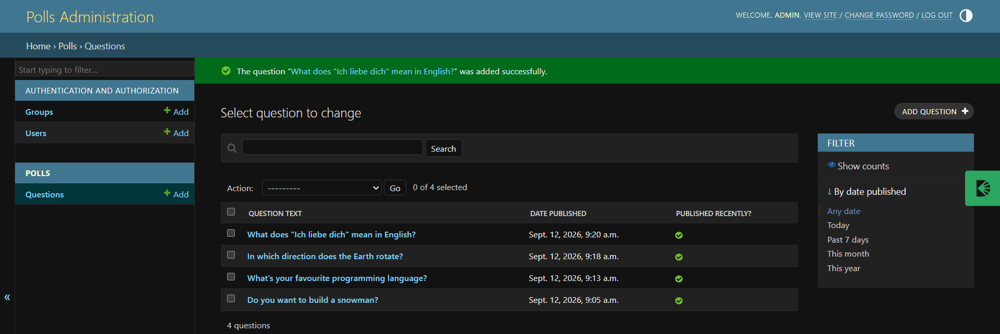

# Polls App

A web application for creating polls and letting users vote on them, built with Django and PostgreSQL. Includes a customized admin dashboard, automated tests, and a production deployment pipeline.

**Live demo:** https://polls-app-udi9.onrender.com/polls/

> Note: hosted on a free-tier server, so the first load after a period of inactivity may take 30–60 seconds while the server wakes up.

## Features

- Create and browse polls with multiple choice options
- Vote on a poll and view live results
- Custom-styled admin dashboard for managing questions and choices, with choices editable inline under each question
- Automated unit tests covering model logic
- Environment-based configuration for seamless switching between local development and production

## Tech Stack

- **Backend:** Django 5.2
- **Database:** PostgreSQL
- **Server:** Gunicorn
- **Static files:** WhiteNoise
- **Hosting:** Render
- **Dev tools:** django-debug-toolbar

## Screenshots

Add a screenshot or two here once available, e.g.:




## Running Locally

**Prerequisites:** Python 3.11+, PostgreSQL installed and running.

```bash
# Clone the repository
git clone https://github.com/dnhnuyn/polls_app.git
cd polls_app

# Create and activate a virtual environment
python -m venv venv
source venv/Scripts/activate  # Windows (Git Bash)
# or: source venv/bin/activate  # macOS/Linux

# Install dependencies
pip install -r requirements.txt

# Create a PostgreSQL database
createdb polls_db  # or create it via pgAdmin

# Configure your database in mysite/settings.py,
# or set a DATABASE_URL environment variable

# Apply migrations
python manage.py migrate

# Create an admin user
python manage.py createsuperuser

# Run the development server
python manage.py runserver
```

Visit `http://127.0.0.1:8000/polls/` to view the app, or `http://127.0.0.1:8000/admin/` to manage polls.

## Project Structure

```
polls_app/
├── mysite/          # Project settings, URL routing
├── polls/           # Main app: models, views, templates, tests
├── build.sh         # Render build script (install deps, collect static, migrate)
├── requirements.txt
└── manage.py
```

## Deployment

The app is deployed on [Render](https://render.com) with a managed PostgreSQL database. On every push to the main branch, Render automatically runs `build.sh` (installing dependencies, collecting static files, and applying migrations) and restarts the service.

## Author

Danh — [GitHub](https://github.com/dnhnuyn)
